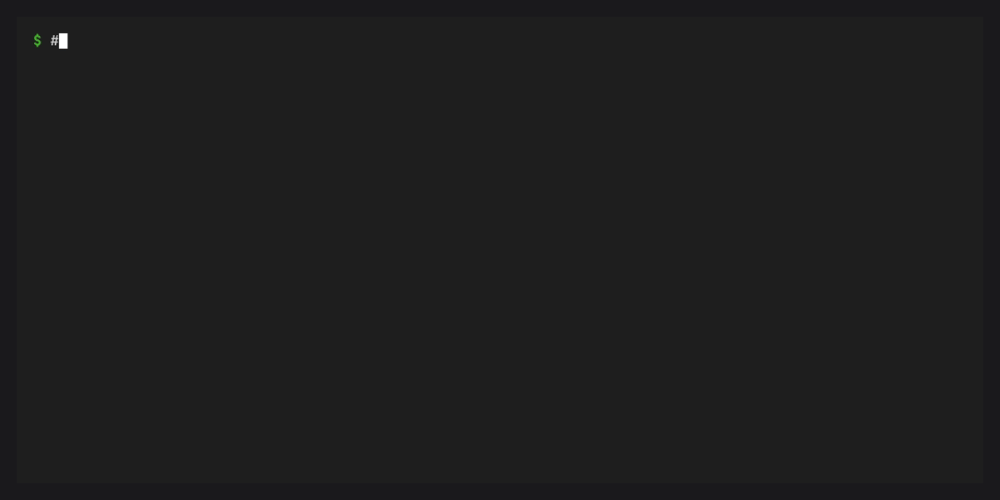

# Features

## Tasks

### Task commands


A task's `cmd` can be a simple string or a list of strings joined with
spaces:

```toml
[tasks]
build = "python -m build"
build-alt = { cmd = ["python", "-m", "build", "--wheel"] }
```

### Task dependencies


Tasks can depend on other tasks. Dependencies are resolved with
topological ordering so everything runs in the right sequence:

```toml
[tasks]
compile = { cmd = "gcc -o main main.c", description = "Compile the program" }
test = { cmd = "./main --test", depends-on = ["compile"], description = "Run tests" }

[tasks.check]
depends-on = ["test", "lint"]
description = "Run all checks"
```

Running `conda task run check` resolves the full dependency graph and
runs each task in order.

### Task aliases

Tasks with no `cmd` that only list dependencies act as aliases:

```toml
[tasks.check]
depends-on = ["test", "lint", "typecheck"]
description = "Run all checks"
```

### Hidden tasks

Tasks prefixed with `_` are hidden from `conda task list` but can still
be referenced as dependencies or run explicitly:

```toml
[tasks]
_setup = "mkdir -p build/"

[tasks.build]
cmd = "make"
depends-on = ["_setup"]
```

### Task arguments


Tasks can accept named arguments with optional defaults:

```toml
[tasks.test]
cmd = "pytest {{ test_path }} -v"
args = [
  { arg = "test_path", default = "tests/" },
]
description = "Run tests on a path"
```

Run with:

```bash
conda task run test src/tests/
```

### Template variables

Commands support Jinja2 templates with `conda.*` context variables:

| Variable | Description |
|---|---|
| `{{ conda.platform }}` | Current platform (e.g. `osx-arm64`) |
| `{{ conda.environment_name }}` | Name of the active conda environment |
| `{{ conda.environment.name }}` | Active environment name |
| `{{ conda.prefix }}` | Target conda environment prefix path |
| `{{ conda.version }}` | conda version |
| `{{ conda.manifest_path }}` | Path to the task file |
| `{{ conda.init_cwd }}` | Current working directory at rendering time |
| `{{ conda.is_win }}` | `True` on Windows |
| `{{ conda.is_unix }}` | `True` on non-Windows |
| `{{ conda.is_linux }}` | `True` on Linux |
| `{{ conda.is_osx }}` | `True` on macOS |

When reading from `pixi.toml`, `{{ pixi.platform }}` etc. also work as
aliases.

### Task environment variables

```toml
[tasks.test]
cmd = "pytest"
env = { PYTHONPATH = "src", DATABASE_URL = "sqlite:///test.db" }
```

### Clean environment

Run a task with only essential environment variables:

```toml
[tasks]
isolated-test = { cmd = "pytest", clean-env = true }
```

Or via CLI: `conda task run test --clean-env`

### Task caching


When `inputs` and `outputs` are specified, tasks are cached and
re-execution is skipped when inputs haven't changed:

```toml
[tasks.build]
cmd = "python -m build"
inputs = ["src/**/*.py", "pyproject.toml"]
outputs = ["dist/*.whl"]
```

:::{tip}
The cache uses a fast `(mtime, size)` pre-check before falling back to
SHA-256 hashing, so the overhead on cache hits is minimal.
:::

### Platform-specific tasks



Override task fields per platform using the `target` key:

::::{tab-set}

:::{tab-item} TOML

```toml
[tasks]
clean = "rm -rf build/"

[target.win-64.tasks]
clean = "rd /s /q build"
```

:::

:::{tab-item} Jinja2 conditional

```toml
[tasks]
clean = "rd /s /q buildrm -rf build/"
```

:::

::::

### Task environment targeting

Tasks run in your current conda environment by default. When used with
a workspace, you can target a specific environment:

```bash
conda task run test -e myenv
```

Tasks can also declare a default environment:

```toml
[tasks.test-legacy]
cmd = "pytest"
default-environment = "py38-compat"
```

---

## Environments


Environments are named conda prefixes composed from one or more features.
Each environment is installed under `.conda/envs/<name>/` in your project.

```toml
[environments]
default = []
test = { features = ["test"] }
docs = { features = ["docs"] }
```

The `default` environment always exists and includes the top-level
`[dependencies]`. Named environments inherit the default feature unless
`no-default-feature = true` is set.

:::{note}
Pixi's `solve-group` key is accepted in manifests for compatibility but
has no effect. Conda's solver operates on a single environment at a time
and does not support cross-environment version coordination. Each
environment is solved independently.
:::

## Features

Features are composable groups of dependencies, channels, and settings.
They map to `[feature.<name>]` tables in the manifest:

```toml
[feature.test.dependencies]
pytest = ">=8.0"
pytest-cov = ">=4.0"

[feature.docs.dependencies]
sphinx = ">=7.0"
myst-parser = ">=3.0"
```

When an environment includes multiple features, dependencies are merged
in order. Later features override earlier ones for the same package name.

## Channels

Channels are specified at the workspace level and can be overridden per
feature:

```toml
[workspace]
channels = ["conda-forge"]

[feature.special.dependencies]
some-pkg = "*"

[feature.special]
channels = ["conda-forge", "bioconda"]
```

Feature channels are appended after workspace channels, with duplicates
removed.

## Platform targeting

Per-platform dependency overrides use `[target.<platform>]` tables:

```toml
[dependencies]
python = ">=3.10"

[target.linux-64.dependencies]
linux-headers = ">=5.10"

[target.osx-arm64.dependencies]
llvm-openmp = ">=14.0"
```

Platform overrides are merged on top of the base dependencies when
resolving for a specific platform.

## PyPI dependencies

PyPI dependencies are specified separately from conda dependencies:

```toml
[pypi-dependencies]
my-local-pkg = { path = ".", editable = true }
some-pypi-only = ">=1.0"

[feature.test.pypi-dependencies]
pytest-benchmark = ">=4.0"
```

PyPI package names are translated to their conda equivalents (via the
[grayskull mapping](https://github.com/conda/grayskull)) and merged
into the same solver call as conda dependencies. This means the rattler
solver resolves conda and PyPI packages together in a single pass, and
`conda-pypi`'s wheel extractor handles `.whl` installation.

To use PyPI dependencies you need:

- [conda-pypi](https://github.com/conda/conda-pypi) for name mapping
  and wheel extraction
- [conda-rattler-solver](https://github.com/conda-incubator/conda-rattler-solver)
  as the solver backend
- A channel that indexes PyPI wheels (e.g. the
  [conda-pypi-test](https://github.com/conda-incubator/conda-pypi-test)
  channel for development)

Editable, git, and URL dependencies (e.g. `path = "."`, `git = "..."`)
are handled separately via `conda-pypi`'s build system after the main
solve completes. If `conda-pypi` is not installed, PyPI dependencies
are skipped with a warning.

## No-default-feature

An environment can opt out of inheriting the default feature:

```toml
[environments]
minimal = { features = ["minimal"], no-default-feature = true }
```

This is useful for environments that need a completely independent
dependency set.

## Activation

Features can specify activation scripts and environment variables:

```toml
[activation]
scripts = ["scripts/activate.sh"]
env = { MY_VAR = "value" }

[feature.dev.activation]
env = { DEBUG = "1" }
```

Activation settings are merged across features when composing an
environment. After `cw install`, environment variables are written to
the prefix state file (available via `conda activate`) and activation
scripts are copied to `$PREFIX/etc/conda/activate.d/`.

## System requirements

System requirements declare minimum system-level dependencies:

```toml
[system-requirements]
cuda = "12"
glibc = "2.17"
```

System requirements are added as virtual package constraints
(`__cuda >=12`, `__glibc >=2.17`) during environment solving. This
ensures the solver only picks packages compatible with the declared
system capabilities.

## Channel priority

The workspace-level `channel-priority` setting overrides conda's global
channel priority during solving:

```toml
[workspace]
channels = ["conda-forge"]
channel-priority = "strict"
```

Valid values are `strict`, `flexible`, and `disabled`. When not set,
conda's default channel priority applies.

## Lock

conda-workspaces generates a `conda.lock` file in YAML format based on
the rattler-lock v6 specification. The `cw lock` command runs the solver
and records the solution — it does not require environments to be
installed first.

```bash
# Generate or update the lockfile
cw lock

# Install from lockfile, validating freshness against the manifest
cw install --locked

# Install from lockfile as-is without checking freshness
cw install --frozen
```

The lockfile contains all environments and their resolved packages:

```yaml
version: 1
environments:
  default:
    channels:
      - url: https://conda.anaconda.org/conda-forge/
    packages:
      linux-64:
        - conda: https://conda.anaconda.org/conda-forge/linux-64/python-3.12.0-...
  test:
    channels:
      - url: https://conda.anaconda.org/conda-forge/
    packages:
      linux-64:
        - conda: https://conda.anaconda.org/conda-forge/linux-64/python-3.12.0-...
        - conda: https://conda.anaconda.org/conda-forge/linux-64/pytest-8.0.0-...
packages:
  - conda: https://conda.anaconda.org/conda-forge/linux-64/python-3.12.0-...
    sha256: abc123...
    depends:
      - libffi >=3.4
    # ...
```

Using `--locked` skips the solver and installs the exact package URLs
recorded in the lockfile. It validates that the lockfile is still fresh
relative to the manifest — if the manifest has changed since the lockfile
was generated, the install fails. Use `--frozen` to skip freshness
checks entirely and install the lockfile as-is.

You can also point to a specific manifest with `--file` / `-f`:

```bash
cw install -f path/to/conda.toml
```

## Project-local environments

All environments are installed under `.conda/envs/` in your project
directory, keeping them isolated from global conda environments:

```
my-project/
├── conda.toml
├── conda.lock
├── .conda/
│   └── envs/
│       ├── default/
│       ├── test/
│       └── docs/
└── src/
```

Environments are standard conda prefixes. Use `cw run -e <name> -- CMD`
to run a command in an environment, `cw shell -e <name>` for an
interactive shell, or `conda activate .conda/envs/<name>` directly.
