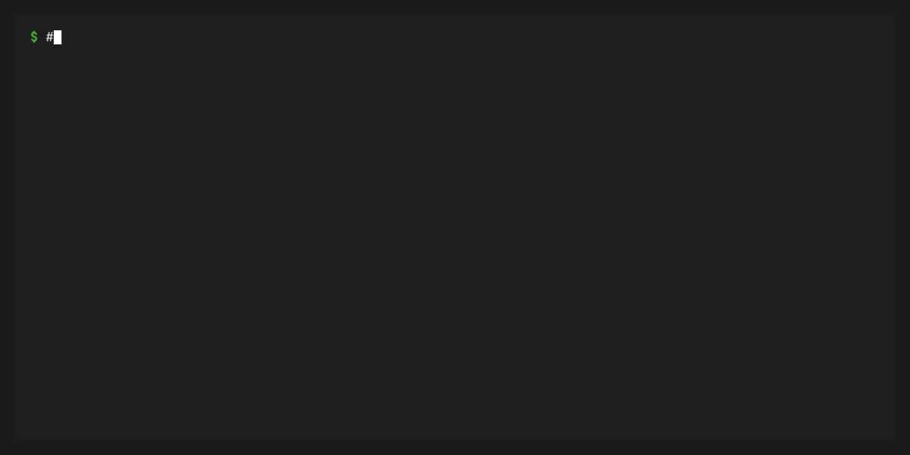
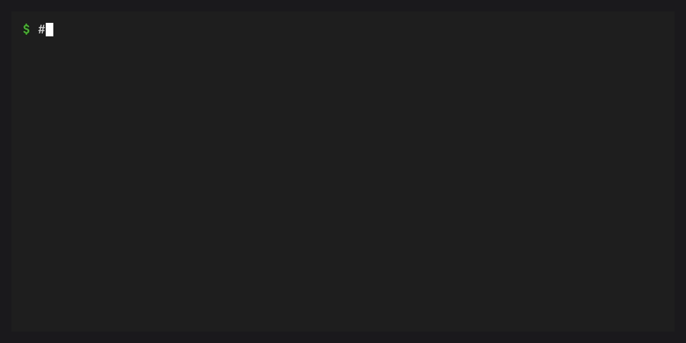
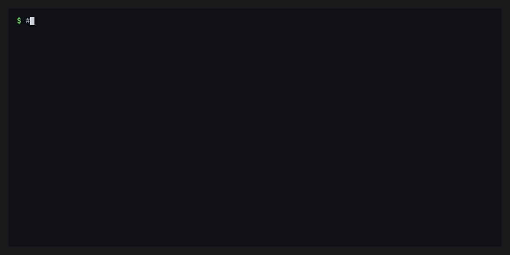

# Quick start

## Installation

::::{tab-set}

:::{tab-item} conda

```bash
conda install -c conda-forge conda-workspaces
```

:::

:::{tab-item} pixi

```bash
pixi global install conda-workspaces
```

:::

::::

Both methods provide the `cw` and `ct` shortcut commands.
Installing into a conda base environment also registers the
`conda workspace` and `conda task` plugin subcommands.

## Your first tasks



Create a `conda.toml` in your project root:

```toml
[tasks]
hello = "echo 'Hello from conda-workspaces!'"
test = { cmd = "pytest tests/ -v", depends-on = ["build"] }
build = "python -m build"
```

Run a task:

```bash
conda task run hello
conda task run test    # runs build first, then test
conda task list        # see all tasks
```

Tasks run in your current conda environment. No workspace definition is
required — you can start with tasks alone and add workspace features later.

## Your first workspace



:::{versionadded} 0.4.0
`conda workspace quickstart` composes `init`, `add`, `install`, and
`shell` into a single bootstrap command; pass `--no-shell` for CI or
`--json` for a scriptable summary.
:::

The fastest path from "empty directory" to "installed environment with
an activated shell" is `conda workspace quickstart`:

```bash
conda workspace quickstart python=3.14 numpy
# or copy an existing workspace's manifest instead of running init
conda workspace quickstart --copy ../other-workspace
# scripted / CI: skip the interactive shell, emit a JSON summary
conda workspace quickstart --no-shell --name demo "python=3.12" "numpy>=2"
conda workspace quickstart --json --name demo "python=3.12"
```

`quickstart` composes the other commands for you: it runs `init`
(unless you pass `--copy` / `--clone` to copy an existing workspace's
manifest), adds any specs passed on the command line, installs the
selected environment, and drops into a shell. It forwards the flags
you already know from `init` (`--format`, `--name`, `-c/--channel`,
`--platform`), `install` (`-e/--environment`, `--force-reinstall`,
`--locked`, `--frozen`), and conda's shared flags (`--dry-run`,
`--json`, `--yes`). Use `--no-shell` for CI or scripted runs; `--json`
implies `--no-shell`, silences the status banners the nested
`init` / `add` / `install` handlers would otherwise print, and emits
a single structured `{workspace, environment, manifest, specs_added,
shell_spawned}` payload on stdout — safe to pipe into `jq`.

### Manual setup



If you prefer to wire the commands together yourself, start from
`conda workspace init` and incrementally add dependencies — each
`add` installs into the affected environment and refreshes
`conda.lock`:

```bash
conda workspace init --name my-project
conda workspace add "python>=3.12" "numpy>=2"
conda workspace add -e test "pytest>=8.0"
conda workspace envs
```

Or add workspace configuration to a `conda.toml` by hand:

::::{tab-set}

:::{tab-item} conda.toml

```toml
[workspace]
name = "my-project"
channels = ["conda-forge"]
platforms = ["linux-64", "osx-arm64", "win-64"]

[dependencies]
python = ">=3.10"
numpy = ">=1.24"

[feature.test.dependencies]
pytest = ">=8.0"
pytest-cov = ">=4.0"

[environments]
default = []
test = { features = ["test"] }
```

:::

:::{tab-item} pixi.toml

```toml
[workspace]
name = "my-project"
channels = ["conda-forge"]
platforms = ["linux-64", "osx-arm64", "win-64"]

[dependencies]
python = ">=3.10"
numpy = ">=1.24"

[feature.test.dependencies]
pytest = ">=8.0"
pytest-cov = ">=4.0"

[environments]
default = []
test = { features = ["test"] }
```

:::

:::{tab-item} pyproject.toml

```toml
[tool.conda.workspace]
name = "my-project"
channels = ["conda-forge"]
platforms = ["linux-64", "osx-arm64", "win-64"]

[tool.conda.dependencies]
python = ">=3.10"
numpy = ">=1.24"

[tool.conda.feature.test.dependencies]
pytest = ">=8.0"
pytest-cov = ">=4.0"

[tool.conda.environments]
default = []
test = { features = ["test"] }
```

:::

::::

:::{tip}
`cw` and `ct` are available as shorter aliases for `conda workspace`
and `conda task`.
:::

Or use the init command to scaffold one:

```bash
conda workspace init
# or: conda workspace init --format conda
# or: conda workspace init --format pyproject
```

## Install environments

```bash
conda workspace install
```

This creates project-local conda environments under `.conda/envs/` for
each environment defined in your manifest. A `conda.lock` file is
generated automatically after solving.

You can point to a specific manifest with `--file` / `-f`:

```bash
conda workspace install -f path/to/conda.toml
```

To recreate environments from scratch, use `--force-reinstall`:

```bash
conda workspace install --force-reinstall
```

## Lock


The `conda workspace lock` command runs the solver and records the solution in
`conda.lock` without installing any environments:

```bash
conda workspace lock
```

## Reproducible installs

Use `--locked` to install from the lockfile. This validates that the
lockfile is still fresh relative to the manifest — if the manifest has
changed, the install fails:

```bash
conda workspace install --locked
```

Use `--frozen` to install from the lockfile as-is, without checking
freshness:

```bash
conda workspace install --frozen
```

## Run in workspace environments

Once your workspace is installed, run tasks in specific environments:

```bash
conda task run -e test pytest -v
```

Run a one-shot command in an environment:

```bash
conda workspace run -e test -- python -c "import numpy; print(numpy.__version__)"
```

Or spawn an interactive shell:

```bash
conda workspace shell -e test
```

## Add and remove dependencies

:::{versionchanged} 0.4.0
`conda workspace add` / `remove` now install into the affected
environment(s) and refresh `conda.lock` by default (matching
`pixi add` / `pixi remove`). Use `--no-install` to update the
manifest and lockfile without touching the prefix, or
`--no-lockfile-update` for the previous manifest-only behaviour.
:::

```bash
conda workspace add numpy
```

`add` and `remove` update the manifest, resolve the affected
environments, install into their prefixes, and refresh `conda.lock`
in one go — the same shape as `pixi add` / `pixi remove`.

Add to a specific feature (only environments composing that feature
are re-synced):

```bash
conda workspace add --feature test pytest
```

Add a PyPI dependency:

```bash
conda workspace add --pypi requests
```

Remove a dependency:

```bash
conda workspace remove numpy
```

If you want the old manifest-only behaviour, or to stage a batch of
edits before running the solver, opt out per command:

```bash
conda workspace add numpy --no-install            # update manifest + conda.lock, skip install
conda workspace add numpy --no-lockfile-update    # update manifest only
conda workspace add numpy --force-reinstall       # recreate the affected env(s) from scratch
conda workspace add numpy --dry-run               # solve only, touch nothing on disk
```

Running `add` or `remove` from inside `conda workspace shell` works,
but an already-activated shell will not pick up new entries under
`$PREFIX/etc/conda/activate.d/` — the command prints a hint asking
you to exit and re-run `conda workspace shell` when that happens.

## List packages and environments

```bash
conda workspace list              # packages in default env
conda workspace list -e test      # packages in test env
conda workspace envs              # list defined environments
```

## Workspace overview

```bash
conda workspace info
conda workspace info -e test      # details for a specific environment
```

## Next steps

- Read about [features](features.md) to learn how environments and tasks work
- See the [configuration](configuration.md) reference for all manifest options
- Check out the [tutorials](tutorials/index.md) for more in-depth guides
